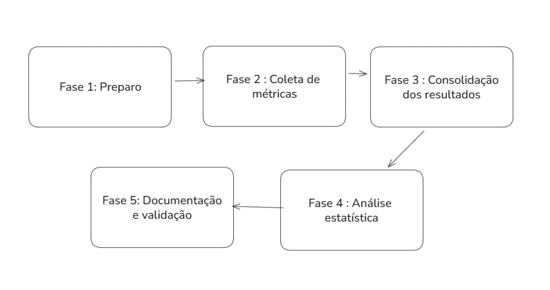

# Plano de Experimento – Scoping e Planejamento
## 1. Identificação básica
### 1.1 Título do experimento
Proposição e Validação de Métricas Estruturais para Detecção de Code Smells em Componentes React.

### 1.1.1 Título do futuro TCC 
Identificação de Code Smells em Componentes React por Meio de Métricas Estruturais.

### 1.2 ID / código
001

### 1.3 Versão do documento e histórico de revisão
v1.0

### 1.4 Datas (criação, última atualização)
Identificação Básica, Contexto e Problema | 23/11/2025


### 1.5 Autores (nome, área, contato)
Pedro Henrique Braga de Castro | Engenharia de Software | pcastro@sga.pucminas.br   

### 1.6 Responsável principal (PI / dono do experimento)
Pedro Henrique Braga de Castro

### 1.7 Projeto / produto / iniciativa relacionada

O experimento está relacionado ao ecossistema React, um dos frameworks mais utilizados no desenvolvimento frontend moderno e às práticas de engenharia de software voltadas à medição e avaliação de qualidade estrutural. Apesar da sua adoção massiva, observa-se que a qualidade dos componentes - unidade central da arquitetura React - nem sempre acompanha a velocidade de crescimento dos projetos, levando a problemas de manutenção, regressões, complexidade excessiva e acoplamento inadequado. Com isso, o propósito central é propor e validar experimentalmente um conjunto inicial de métricas estruturais específicas para componentes React, orientadas a detectar más práticas e sinais de degradação estrutural. Essas métricas visam apoiar atividades de manutenção, evolução e arquitetura frontend em sistemas de grande porte.

## 2. Contexto e problema
### 2.1 Descrição do problema / oportunidade

Projetos React tendem a acumular componentes degradados ao longo do tempo, manifestando problemas como complexidade excessiva, acoplamento indevido, má organização interna e presença de más práticas documentadas. Atualmente não existe um conjunto padronizado de métricas estruturais específicas para componentes React, capazes de mensurar objetivamente a presença de más práticas documentadas (bad smells), complexidade excessiva, acoplamento indevido ou organização inadequada. A oportunidade deste experimento reside em propor tais métricas, aplicá-las a componentes reais e avaliar empiricamente seu poder de identificação de sinais de degradação estrutural.

### 2.2 Contexto organizacional e técnico

O experimento será conduzido em um ambiente simulado baseado em:
- Projetos React open-source consolidados (médio e grande porte);
- Ferramentas de análise estática, como ESLint AST, Babel Parser e TypeScript Compiler API;
- Padrões modernos de desenvolvimento React: hooks, composição de componentes, context API, CMS, Redux, Zustand;
- Fluxo de trabalho típico com múltiplos contribuidores.

### 2.3 Trabalhos e evidências prévias (internos e externos)

- CK Metrics (Chidamber & Kemerer, 1994): conjunto clássico de métricas para classes OO (WMC, CBO, RFC, LCOM, DIT, NOC). São estruturais e inspiram a abordagem deste experimento.
- Trabalhos sobre medição de manutenção e debilidade de componentes em frameworks frontend (Angular, Vue), mas sem padronização para React.
- Experimentos em literatura de engenharia de software investigando correlação entre métricas estáticas e defeitos.
- Fabio Ferreira e Marco Tulio Valente: Detecting code smells in React-based Web apps.
- Fábio da Silva Ferreira: Assisting JavaScript Front-End Developers in Maintaining and Evolving React-Based Applications: Code Smells and Refactoring Operations.
  
Não há um conjunto consolidado de métricas estruturais específicas para componentes React, reforçando a relevância do estudo.

### 2.4 Referencial teórico e empírico essencial
Os principais conceitos que fundamentam o experimento são:

- Teoria de Métricas de Software: medição objetiva baseada em atributos estruturais observáveis no código.
- CK Metrics: mostram que métricas estruturais podem prever manutenção e defeitos em sistemas POO.
- Conceito de Saúde do Software (Software Health): envolve manutenibilidade, simplicidade, clareza, baixo acoplamento e complexidade aceitável.
- Arquitetura orientada a componentes: em React, o componente é a unidade funcional mínima, equivalente à classe em POO para fins de análise estrutural.
- Análise estática de código: permite mensurar atributos do componente sem execução, essencial para replicabilidade.
- Más práticas em React: tais como violações das Regras dos Hooks, dependências não declaradas, componentes excessivamente grandes, uso inadequado de efeitos, acoplamento entre UI e lógica de negócios e renderizações inconsistentes. 


## 3. Definição do GQM (Goal / Question / Metric)
### 3.1 Objetivo geral 

Propor, testar e validar um conjunto inicial de métricas estruturais específicas para componentes React, com o propósito de avaliar sua saúde estrutural em sistemas de grande porte, a partir de más práticas documentadas e evidências empíricas extraídas de projetos reais.

### 3.2 Objetivos específicos

- O1. Identificar, a partir da literatura e da documentação oficial, más práticas estruturais em React.
- O2. Definir um conjunto inicial de métricas estruturais capazes de quantificar essas más práticas e aspectos de qualidade dos componentes.
- O3. Aplicar as métricas em um conjunto real de componentes React provenientes de sistemas de grande porte.
- O4. Analisar os resultados das métricas segundo critérios de complexidade, acoplamento, modularidade e presença de antipadrões.
- O5. Avaliar a validade, utilidade e consistência das métricas propostas por meio de análises empíricas e interpretações estruturais.

### 3.3 Questões de pesquisa / de negócio
- O1. Identificar más práticas estruturais em React:
  - Q1.1: Quais más práticas estruturais são recorrentes em componentes React?
  - Q1.2: Quais padrões do React são frequentemente violados?
  - Q1.3: Como essas más práticas se distribuem em componentes reais?

- O2. Definir métricas estruturais para quantificar más práticas e atributos de qualidade.
  - Q2.1: Quais métricas estruturais conseguem representar adequadamente complexidade, acoplamento e modularidade?
  - Q2.2: As métricas propostas capturam diferenças reais entre componentes saudáveis e degradados?
  - Q2.3: As métricas cobrem todos as más práticas identificadas no O1?

- O3. Aplicar as métricas a componentes reais.
  - Q3.1: Como as métricas se comportam em componentes de sistemas grandes?
  - Q3.2: Há componentes que se destacam como outliers?
  - Q3.3: Quais antipadrões aparecem com maior frequência nos sistemas analisados?

- O4. Analisar resultados segundo critérios estruturais.
  - Q4.1 Componentes maiores são mais complexos?
  - Q4.2 Componentes com alto acoplamento apresentam mais antipadrões?
  - Q4.3 Modularização adequada está associada a menos violações das regras do React?

- O5. Avaliar validade e utilidade das métricas.
  - Q5.1 As métricas diferenciam componentes saudáveis vs. problemáticos?
  - Q5.2 As métricas são consistentes entre diferentes projetos?
  - Q5.3 As métricas capturam casos reais de antipadrões documentados?

### 3.4 Tabela GQM
| **Objetivo (O)**                                                                           | **Perguntas (Q)**                                                                     | **Métricas (M)**                                                                                           |
| ------------------------------------------------------------------------------------------ | ------------------------------------------------------------------------------------- | ---------------------------------------------------------------------------------------------------------- |
| **O1. Identificar más práticas estruturais em componentes React.**                         | Q1.1 Quais más práticas aparecem com maior frequência nos componentes?                | M1 – Contagem de violações das Rules of Hooks<br>M2 – Número de dependências ausentes/erradas em useEffect |
|                                                                                            | Q1.2 Quais antipadrões estruturais estão associados a componentes maiores?            | M3 – Tamanho do componente (LOC)<br>M4 – Número de responsáveis (SRP Violations)                           |
|                                                                                            | Q1.3 Quais padrões de código indicam degradação estrutural ao longo do tempo?         | M5 – Crescimento histórico de LOC<br>M6 – Crescimento de branches condicionais                             |
| **O2. Definir métricas estruturais para medir más práticas e atributos de qualidade.**     | Q2.1 Cada má prática pode ser quantificada por uma métrica objetiva?                  | M7 – Métricas definidas por antipadrão<br>M8 – Mapeamento métrica ↔ má prática                             |
|                                                                                            | Q2.2 As métricas capturam aspectos de complexidade documentados pela literatura?      | M1 – Violações de hooks<br>M9 – Complexidade ciclomatica (CC)                                              |
|                                                                                            | Q2.3 As métricas são estáveis o suficiente para serem replicáveis?                    | M10 – Variabilidade da métrica por executor<br>M11 – Precisão da métrica por análise estática              |
| **O3. Aplicar as métricas em componentes reais.**                                          | Q3.1 Os valores das métricas variam entre componentes simples e complexos?            | M3 – LOC<br>M9 – Complexidade ciclomatica                                                                  |
|                                                                                            | Q3.2 O acoplamento interno e externo varia conforme o tamanho do componente?          | M12 – Número de imports<br>M13 – Número de hooks customizados usados                                       |
|                                                                                            | Q3.3 Há correlação entre antipadrões e tamanho/complexidade?                          | M4 – SRP Violations<br>M9 – Complexidade ciclomatica                                                       |
| **O4. Analisar resultados segundo complexidade, acoplamento, modularidade e antipadrões.** | Q4.1 Quais métricas mais diferenciam componentes saudáveis de problemáticos?          | M3 – LOC<br>M12 – Imports                                                                                  |
|                                                                                            | Q4.2 O acoplamento é um indicador forte de baixa saúde estrutural?                    | M12 – Imports<br>M14 – Fan-in / Fan-out                                                                    |
|                                                                                            | Q4.3 A modularização via subcomponentes melhora as métricas?                          | M15 – Número de subcomponentes<br>M13 – Hooks customizados                                                 |
| **O5. Avaliar utilidade e validade das métricas propostas.** | Q5.1 As métricas representam corretamente as más práticas documentadas?   | M1 – Violações de Hooks<br>M2 – Dependências incorretas<br>M7 – Métricas por antipadrão |
|                                                              | Q5.2 Especialistas consideram as métricas úteis para avaliar componentes? | M16 – Avaliação por especialistas<br>M17 – Concordância entre avaliadores               |
|                                                              | Q5.3 As métricas são consistentes ao analisar componentes diferentes?     | M10 – Variabilidade<br>M11 – Precisão da análise estática                               |


 ### 3.5 Métricas associadas (GQM)
| **Métrica**                                 | **Descrição**                                                              | **Unidade**   |
| ------------------------------------------- | -------------------------------------------------------------------------- | ------------- |
| **M1 – Violações das Rules of Hooks**       | Número de violações detectadas (hooks dentro de condições, loops, etc.)    | contagem      |
| **M2 – Erros de dependências do useEffect** | Dependências ausentes ou incorretas no array do effect                     | contagem      |
| **M3 – Lines of Code (LOC)**                | Tamanho total do componente em linhas de código                            | linhas        |
| **M4 – SRP Violations**                     | Quantidade de responsabilidades distintas detectadas no componente         | contagem      |
| **M5 – Crescimento histórico de LOC**       | Aumento do tamanho do componente ao longo de commits                       | linhas/commit |
| **M6 – Branch Complexity**                  | Número de condicionais e ramificações internas                             | contagem      |
| **M7 – Métricas por antipadrão**            | Métrica específica que quantifica um bad smell (ex.: “deep prop drilling”) | contagem      |
| **M8 – Mapeamento métrica ↔ má prática**    | Quantidade de más práticas cobertas por métricas                           | percentual    |
| **M9 – Complexidade Ciclomática**           | Total de caminhos independentes                                            | grau          |
| **M10 – Variabilidade por executor**        | Diferença de resultados entre execuções distintas                          | percentual    |
| **M11 – Precisão da análise estática**      | Percentual de acertos da ferramenta de análise                             | percentual    |
| **M12 – Número de imports**                 | Dependências externas do componente                                        | contagem      |
| **M13 – Hooks customizados usados**         | Quantidade de hooks customizados consumidos                                | contagem      |
| **M14 – Fan-in / Fan-out**                  | Acoplamento estrutural interno e externo                                   | grau          |
| **M15 – Número de subcomponentes**          | Quantidade de componentes filhos diretos                                   | contagem      |
| **M16 – Avaliação por especialistas**       | Nota qualitativa dada por engenheiros                                      | escala (0–5)  |
| **M17 – Concordância entre avaliadores**    | Medida de consenso (ex.: Kappa)                                            | percentual    |
| **M18 – Histórico de defeitos**             | Quantidade de bugs associados ao componente                                | contagem      |


## 4. Escopo e contexto do experimento
### 4.1 Escopo funcional / de processo (incluído e excluído)

**Incluído no experimento**: 
- Componentes React em JavaScript ou TypeScript presentes em projetos open-source de médio/grande porte tanto sistemas React quanto Next.js.
- Análise estática dos componentes usando AST (Babel Parser, TypeScript Compiler API e ESLint Rules).
- Métricas estruturais definidas no GQM (complexidade, acoplamento, tamanho, violações de hooks, uso de subcomponentes etc.).
- Aplicação das métricas em repositórios selecionados e comparação entre componentes.
- Avaliação qualitativa por especialistas sobre utilidade e validade das métricas.
  
**Excluído do experimento:**
- Métricas de desempenho em tempo de execução.
- Avaliação de UX, design visual ou qualidade subjetiva da interface.
- Código não relacionado a componentes React (ex.: utils, serviços, configurações).
- Métricas específicas de frameworks externos (Next.js, Remix), a menos que envolvam componentes React.

### 4.2 Contexto do estudo (tipo de organização, projeto, experiência)

O experimento ocorrerá em ambiente acadêmico, utilizando:
- Projetos React open-source populares, com histórico de commits e múltiplos contribuidores.
- Repositórios variando entre **50 e 500+ componentes**, permitindo análise heterogênea.
- Participação eventual de **2 a 4 desenvolvedores experientes** (avaliadores) com prática em React, para julgamento qualitativo de algumas métricas.

O objetivo é simular um cenário de engenharia de software realista, mas controlado, permitindo replicabilidade.

### 4.3 Premissas

- Os projetos open-source selecionados permanecerão acessíveis durante a execução.
- As ferramentas de análise estática serão capazes de processar todos os componentes analisados.
- Os especialistas convidados terão disponibilidade para revisar e avaliar as métricas qualitativas.
- O histórico de commits dos projetos contém informação suficiente para medir crescimento estrutural (M5).
- As métricas definidas são aplicáveis a componentes funcionais (forma dominante no React atual).

### 4.4 Restrições

- Tempo limitado para análise manual e para entrevistas com especialistas.
- Ferramentas de AST podem apresentar limitações com sintaxes menos comuns ou configurações específicas.
- Amostragem restrita a repositórios open-source, podendo não refletir o contexto de empresas.
- A extração de métricas históricas depende da estrutura do repositório (granularidade dos commits).

### 4.5 Limitações previstas

- **Validade externa:** resultados podem não generalizar para equipes com padrões internos muito específicos.
- **Validade de construto:** algumas métricas podem capturar parcialmente um antipadrão, não sua totalidade.
- **Validade estatística:** sample size limitado pode reduzir poder inferencial.
- **Viés de seleção:** escolha dos repositórios pode influenciar os resultados.

## 5. Stakeholders e impacto esperado
### 5.1 Stakeholders principais

- **Pesquisador.**
- **Desenvolvedores de React.**
- **Arquitetos de software frontend.**
- **Comunidade acadêmica em engenharia de software.**

### 5.2 Interesses e expectativas dos stakeholders

| Stakeholder     | Interesse / Expectativa                                                                   |
| --------------- | ----------------------------------------------------------------------------------------- |
| Pesquisador     | Validar a viabilidade, utilidade e consistência das métricas propostas.                   |
| Desenvolvedores | Obter métricas objetivas para apoiar refatorações, manutenção e revisão de código.        |
| Arquitetos      | Ferramentas para detectar degradação estrutural ao longo do ciclo de vida do projeto.     |
| Academia        | Produzir evidências empíricas sobre métricas estruturais aplicadas a frameworks modernos. |

### 5.3 Impactos potenciais no processo / produto

- Introdução de métricas úteis para orientar decisões de refatoração.
- Identificação de componentes candidatos a melhoria ou redesign.
- Criação de uma base empírica para futuros estudos sobre qualidade de componentes no ecossistema React.
- Possível adoção preliminar das métricas (ou de subset delas) por equipes de desenvolvimento.

## 6. Riscos de alto nível, premissas e critérios de sucesso
### 6.1 Riscos de alto nível (negócio, técnicos, etc.)

| Categoria      | Risco                                                                                       |
| -------------- | ------------------------------------------------------------------------------------------- |
| Técnico        | Ferramentas de análise podem falhar com certos padrões de código ou sintaxes avançadas.     |
| Organizacional | Indisponibilidade de especialistas para avaliação qualitativa.                              |
| Científico     | Métricas definidas podem não apresentar correlação clara com antipadrões.                   |
| Operacional    | Tempo insuficiente para processar todos os repositórios ou componentes desejados.           |
| Dados          | Repositórios podem ter histórico de commits granular insuficiente para métricas históricas. |

### 6.2 Critérios de sucesso globais (go / no-go)

O experimento será considerado **bem-sucedido** se:
- Um conjunto mínimo viável de métricas estruturais (≥ 8) puder ser definido e operacionalizado.
- As métricas forem aplicáveis em pelo menos 80% dos componentes analisados.
- A análise empírica mostrar variação real das métricas entre componentes saudáveis e degradados.
- Pelo menos dois especialistas confirmarem utilidade parcial ou total das métricas.
- Houver evidência de que algumas métricas correlacionam-se com antipadrões observados.

### 6.3 Critérios de parada antecipada (pré-execução)

O experimento será suspenso antes de iniciar caso:
- Não haja repositórios adequados para análise (tamanho, histórico, estrutura).
- As ferramentas de análise estática não consigam ser configuradas para operar no ambiente definido.
- Falta completa de disponibilidade de especialistas para avaliação qualitativa.
- Mudança significativa no escopo que inviabilize o objetivo original do experimento.

## 7. Modelo conceitual e hipóteses
### 7.1 Modelo conceitual do experimento

O modelo conceitual deste experimento baseia-se na seguinte premissa:

**Componentes React com presença de code smells e más práticas estruturais apresentam valores elevados em métricas estruturais específicas (complexidade, acoplamento, tamanho e violações de regras), e essas métricas podem identificá-los objetivamente.**

O modelo assume que:
- Tamanho excessivo (LOC elevado) está associado a violação do Princípio de Responsabilidade Única (SRP).
- Complexidade ciclomática elevada indica dificuldade de compreensão e manutenção.
- Alto acoplamento (muitos imports, dependências externas) reduz modularidade e aumenta fragilidade.
- Violações das Rules of Hooks e dependências incorretas em useEffect são indicadores diretos de más práticas.
- Componentes com antipadrões apresentam padrões estruturais detectáveis por análise estática.

Esses fatores estruturais atuam como variáveis independentes observáveis que influenciam a qualidade estrutural percebida (variável dependente), a qual pode ser confirmada por análise de especialistas e por histórico de defeitos.

### 7.2 Hipóteses formais (H0, H1)

#### Hipótese 1 – Tamanho e Complexidade
- H0₁: Não há correlação significativa entre o tamanho do componente (LOC) e sua complexidade ciclomática.
- H1₁: Componentes maiores apresentam complexidade ciclomática significativamente maior (correlação positiva).

#### Hipótese 2 – Acoplamento e Antipadrões
- H0₂: Componentes com alto acoplamento (número de imports) não apresentam mais violações de boas práticas do que componentes com baixo acoplamento.
- H1₂: Componentes com alto acoplamento apresentam significativamente mais violações das Rules of Hooks e dependências incorretas.

#### Hipótese 3 – Modularização e Qualidade
- H0₃: O uso de subcomponentes e hooks customizados não está associado a menores valores de complexidade e acoplamento.
- H1₃: Componentes que utilizam subcomponentes e hooks customizados apresentam menor complexidade e acoplamento.

#### Hipótese 4 – Métricas e Avaliação de Especialistas
- H0₄: Não há diferença significativa nos valores das métricas entre componentes classificados como "saudáveis" e "problemáticos" por especialistas.
- H1₄: Componentes classificados como "problemáticos" por especialistas apresentam valores significativamente mais elevados nas métricas estruturais propostas.

#### Hipótese 5 – Histórico de Defeitos
- H0₅: Não há correlação entre métricas estruturais elevadas e o histórico de defeitos do componente.
- H1₅: Componentes com métricas estruturais elevadas apresentam maior quantidade de defeitos registrados no histórico.

### 7.3 Nível de significância e considerações de poder

- Nível de significância: α = 0,05 (5%), padrão para estudos experimentais em engenharia de software.
- Poder estatístico desejado: β ≥ 0,80 (80%), indicando 80% de chance de detectar um efeito real quando ele existir.

Considerações:
- Dado que a amostra será composta por 50 a 200 componentes de projetos open-source, espera-se poder estatístico adequado para detectar correlações moderadas a fortes (r ≥ 0,3).
- Para testes de comparação entre grupos (componentes saudáveis vs. problemáticos), o tamanho amostral planejado permite detectar diferenças de tamanho de efeito médio (d de Cohen ≥ 0,5).
- Caso o poder se mostre insuficiente durante análises preliminares, a amostra poderá ser expandida com novos repositórios.
- Análises não paramétricas (Spearman, Mann-Whitney) serão utilizadas quando premissas de normalidade não forem atendidas, mantendo robustez estatística.

## 8. Variáveis, fatores, tratamentos e objetos de estudo
### 8.1 Objetos de estudo

Os objetos de estudo deste experimento são componentes React extraídos de projetos open-source de médio e grande porte. Especificamente:

- Componentes funcionais escritos em JavaScript ou TypeScript.
- Componentes que utilizam React Hooks (useState, useEffect, useContext, useMemo, useCallback, hooks customizados).
- Componentes presentes em repositórios com:
  - Pelo menos 50 componentes no total.
  - Múltiplos contribuidores (≥ 3 desenvolvedores).

Exemplos de repositórios candidatos:
- Projetos de dashboards administrativos.
- Aplicações de e-commerce.
- Sistemas de gerenciamento de conteúdo (CMS).
- Plataformas SaaS open-source.

Cada componente será analisado individualmente, e suas métricas estruturais serão extraídas via análise estática (AST).

### 8.2 Sujeitos / participantes (visão geral)

O experimento envolverá dois tipos de participantes:

#### 8.2.1 Participantes Diretos: Especialistas Avaliadores
- Quantidade: 2 a 4 desenvolvedores.
- Perfil: Experiência profissional com React (≥ 2 anos), familiaridade com hooks, boas práticas e padrões de código.
- Papel: Avaliar qualitativamente um subconjunto de componentes (classificando-os como "saudáveis", "moderados" ou "problemáticos") para validar as métricas.

#### 8.2.2 Participantes Indiretos: Desenvolvedores dos Projetos Open-Source
- Os componentes analisados foram escritos por desenvolvedores reais, mas estes não participarão ativamente do experimento.
- Seus commits e histórico de defeitos (issues, pull requests) serão usados como dados secundários.

### 8.3 Variáveis independentes (fatores) e seus níveis

As variáveis independentes são características estruturais observadas nos componentes, categorizadas em níveis para análise comparativa.

#### Tabela de Variáveis Independentes

| Variável Independente              | Descrição                                                      | Níveis                          | Como será medida                     |
| -------------------------------------- | ------------------------------------------------------------------ | ----------------------------------- | ---------------------------------------- |
| Tamanho do Componente              | Quantidade de linhas de código do componente                       | Pequeno (<100 LOC), Médio (100-300 LOC), Grande (>300 LOC) | Análise estática via AST                 |
| Complexidade Ciclomática           | Número de caminhos independentes no código                         | Baixa (≤5), Média (6-15), Alta (>15) | Ferramenta de análise estática           |
| Acoplamento Externo                | Número de imports e dependências externas                          | Baixo (≤5), Médio (6-15), Alto (>15) | Contagem de imports via AST              |
| Uso de Hooks Customizados         | Quantidade de hooks customizados utilizados                        | Nenhum (0), Poucos (1-3), Muitos (>3) | Análise de padrão de nomenclatura (use*) |
| Número de Subcomponentes          | Quantidade de componentes filhos diretos                           | Nenhum (0), Poucos (1-2), Muitos (>2) | Análise de declarações JSX internas      |
| Violações das Rules of Hooks       | Presença de violações das regras oficiais do React                 | Sem violações (0), Com violações (≥1) | ESLint rules (exhaustive-deps, rules-of-hooks) |
| Dependências Incorretas em Effects | Erros no array de dependências do useEffect                        | Sem erros (0), Com erros (≥1)       | ESLint rule: exhaustive-deps             |
| Histórico de Crescimento           | Taxa de crescimento do componente (LOC ao longo do tempo)          | Estável (<10%), Moderado (10-50%), Acelerado (>50%) | Análise de histórico Git                 |

### 8.4 Tratamentos (condições experimentais)

Este experimento é observacional (não há manipulação ativa de tratamentos). No entanto, os componentes serão estratificados em grupos para análise comparativa:

#### Tabela de Fatores e Tratamentos

| Fator                    | Tratamento / Condição         | Descrição                                                                 | Critério de Classificação                  |
| ---------------------------- | --------------------------------- | ----------------------------------------------------------------------------- | ---------------------------------------------- |
| Categoria de Tamanho     | Grupo 1: Componentes Pequenos | Componentes com menos de 100 linhas                                           | LOC < 100                                      |
|                              | Grupo 2: Componentes Médios   | Componentes entre 100 e 300 linhas                                            | 100 ≤ LOC ≤ 300                                |
|                              | Grupo 3: Componentes Grandes  | Componentes com mais de 300 linhas                                            | LOC > 300                                      |
| Categoria de Complexidade| Grupo A: Baixa Complexidade   | Complexidade ciclomática ≤ 5                                                  | CC ≤ 5                                         |
|                              | Grupo B: Média Complexidade   | Complexidade ciclomática entre 6 e 15                                         | 6 ≤ CC ≤ 15                                    |
|                              | Grupo C: Alta Complexidade    | Complexidade ciclomática > 15                                                 | CC > 15                                        |
| Categoria de Acoplamento | Grupo X: Baixo Acoplamento    | Componentes com até 5 imports                                                 | Imports ≤ 5                                    |
|                              | Grupo Y: Médio Acoplamento    | Componentes com 6 a 15 imports                                                | 6 ≤ Imports ≤ 15                               |
|                              | Grupo Z: Alto Acoplamento     | Componentes com mais de 15 imports                                            | Imports > 15                                   |
| Presença de Antipadrões  | Grupo Saudável                | Componentes sem violações de hooks e sem erros de dependências                | Violações = 0 e Erros de deps = 0              |
|                              | Grupo Problemático            | Componentes com pelo menos uma violação de hooks ou erro de dependências      | Violações ≥ 1 ou Erros de deps ≥ 1             |
| Uso de Modularização     | Grupo Modularizado            | Componentes que usam subcomponentes ou hooks customizados                     | Subcomponentes > 0 ou Hooks customizados > 0   |
|                              | Grupo Monolítico              | Componentes sem subcomponentes nem hooks customizados                         | Subcomponentes = 0 e Hooks customizados = 0    |

#### Combinações de Tratamentos

Serão analisadas combinações de fatores para investigar interações. Por exemplo:
- Componentes Grandes + Alta Complexidade + Alto Acoplamento (suspeita de múltiplos code smells).
- Componentes Pequenos + Baixa Complexidade + Modularizados (referência de boa prática).
- Componentes Médios + Problemáticos (candidatos a refatoração prioritária).

### 8.5 Variáveis dependentes (respostas)

As variáveis dependentes são as métricas estruturais que serão coletadas e analisadas:

#### Tabela de Variáveis Dependentes

| Variável Dependente                | Descrição                                              | Unidade de Medida | Método de Coleta             |
| -------------------------------------- | ---------------------------------------------------------- | --------------------- | -------------------------------- |
| M1 – Violações das Rules of Hooks  | Quantidade de violações detectadas                         | Contagem              | ESLint (rules-of-hooks)          |
| M2 – Erros de dependências         | Dependências ausentes ou incorretas no useEffect           | Contagem              | ESLint (exhaustive-deps)         |
| M3 – Lines of Code (LOC)           | Tamanho total do componente                                | Linhas                | AST (Babel/TypeScript)           |
| M4 – SRP Violations                | Responsabilidades distintas detectadas                     | Contagem              | Heurística baseada em estados/effects |
| M5 – Crescimento histórico de LOC  | Taxa de crescimento do componente                          | Percentual (%)        | Git log + análise de diffs       |
| M6 – Branch Complexity             | Número de condicionais e ramificações                      | Contagem              | AST (contagem de if/switch/ternários) |
| M9 – Complexidade Ciclomática      | Total de caminhos independentes                            | Grau                  | Ferramenta de análise estática   |
| M12 – Número de imports            | Dependências externas do componente                        | Contagem              | AST (import statements)          |
| M13 – Hooks customizados usados    | Quantidade de hooks customizados consumidos                | Contagem              | AST (padrão use*)                |
| M14 – Fan-in / Fan-out             | Acoplamento estrutural interno e externo                   | Grau                  | Análise de dependências          |
| M15 – Número de subcomponentes     | Quantidade de componentes filhos diretos                   | Contagem              | AST (componentes internos)       |
| M16 – Histórico de defeitos        | Quantidade de bugs associados ao componente                | Contagem              | GitHub Issues + Git blame        |

### 8.6 Variáveis de controle / bloqueio

Variáveis que serão controladas para reduzir vieses:

| Variável de Controle       | Estratégia de Controle                                                              |
| ------------------------------ | --------------------------------------------------------------------------------------- |
| Linguagem                  | Apenas componentes em JavaScript ou TypeScript (ECMAScript 2015+)                       |
| Versão do React            | Apenas projetos usando React ≥ 16.8 (introdução de hooks)                              |
| Tipo de Componente         | Apenas componentes funcionais (exclusão de class components)                            |
| Tamanho do Projeto         | Apenas projetos com 50 a 500 componentes (evitar extremos)                             |
| Maturidade do Projeto      | Apenas repositórios com ≥ 6 meses de histórico e múltiplos contribuidores               |
| Configuração do ESLint     | Uso de configuração padrão + regras oficiais do React (eslint-plugin-react-hooks)       |
| Framework Adicional        | Permitir Next.js, mas apenas analisar componentes React puros (não páginas ou rotas)   |

### 8.7 Possíveis variáveis de confusão conhecidas

Variáveis que podem distorcer os resultados e precisam ser monitoradas:

| Variável de Confusão            | Descrição                                                                           | Como será tratada                                      |
| ----------------------------------- | --------------------------------------------------------------------------------------- | ---------------------------------------------------------- |
| Experiência dos desenvolvedores | Componentes escritos por devs inexperientes podem ter mais problemas estruturais        | Registrar número de contribuidores e tempo de experiência  |
| Domínio da aplicação            | Componentes de domínios complexos (ex.: dashboards financeiros) podem ser naturalmente maiores | Categorizar componentes por tipo (UI puro, lógica de negócio, misto) |
| Idade do código                 | Componentes antigos podem usar padrões desatualizados                                   | Registrar data do último commit e versão do React usada    |
| Pressão de prazo                | Código escrito sob pressão pode ter mais code smells                                    | Não controlável, mas será registrado se houver indícios (commits grandes/rápidos) |
| Presença de TypeScript          | Projetos TypeScript podem ter menos erros estruturais devido à tipagem                  | Estratificar análise por linguagem (JS vs TS)              |
| Uso de bibliotecas de UI        | Componentes que usam MUI, Ant Design, etc. podem ter estrutura diferente                | Registrar bibliotecas de UI usadas no projeto               |
| Contexto de teste               | Componentes bem testados podem ter estrutura mais modular                               | Registrar presença de testes unitários por componente       |

## 9. Desenho experimental
### 9.1 Tipo de desenho (completamente randomizado, blocos, fatorial, etc.)

O experimento adotará um desenho observacional estratificado com análise fatorial.

#### Justificativa:

1. Desenho Observacional:
- Não há manipulação ativa de variáveis independentes (não é possível "criar" componentes com diferentes níveis de complexidade de forma controlada).
- Os componentes já existem em projetos reais, e suas características estruturais serão observadas e medidas.
- Este tipo de desenho é adequado para estudos exploratórios e descritivos que buscam identificar padrões e correlações em contextos reais.

2. Estratificação:
- Os componentes serão estratificados em grupos segundo características estruturais (tamanho, complexidade, acoplamento).
- Isso permite comparações controladas entre estratos (ex.: "componentes pequenos vs. grandes").
- A estratificação reduz a heterogeneidade dentro dos grupos, aumentando o poder estatístico.

3. Análise Fatorial:
- Serão investigadas interações entre fatores (ex.: "tamanho × complexidade", "acoplamento × presença de antipadrões").
- Isso permite compreender se a combinação de fatores amplifica problemas estruturais.
- Exemplo: componentes grandes E altamente acoplados podem apresentar mais code smells do que grandes OU altamente acoplados isoladamente.

4. Componente de Validação Qualitativa:
- Um subconjunto de componentes (amostra estratificada) será avaliado por especialistas humanos.
- Isso introduz um elemento de validação externa das métricas, essencial para verificar se elas refletem problemas reais percebidos por profissionais.

### 9.2 Randomização e alocação

#### O que será randomizado:

1. Seleção de Componentes para Análise Detalhada:
- De cada repositório, será selecionada uma amostra aleatória estratificada de componentes.
- Processo:
  1. Listar todos os componentes do repositório.
  2. Estratificar por tamanho (pequeno, médio, grande).
  3. Sortear aleatoriamente componentes de cada estrato (usando `random.sample()` do Python ou similar).
  4. Garantir representatividade de cada estrato (mínimo de 10 componentes por estrato, se disponível).

2. Ordem de Apresentação aos Especialistas:
- Os componentes serão apresentados aos especialistas em ordem aleatória para evitar viés de ordem.
- Processo:
  1. Gerar lista de componentes selecionados para avaliação qualitativa.
  2. Embaralhar aleatoriamente a ordem (usando `shuffle()`).
  3. Cada especialista receberá a mesma lista, mas em ordem diferente (randomização individual).

3. Alocação de Especialistas a Componentes:
- Cada componente será avaliado por pelo menos 2 especialistas diferentes (para calcular concordância interavaliadores).
- Processo:
  1. Dividir o conjunto de componentes em blocos.
  2. Alocar aleatoriamente especialistas a blocos, garantindo que cada componente seja visto por 2+ avaliadores.

#### Ferramentas e Procedimentos:
- Linguagem: Python (bibliotecas `random`, `numpy.random`).
- Seed de randomização: Será fixada e documentada para garantir reprodutibilidade.
- Registro: Todas as listas randomizadas serão salvas em arquivos CSV com timestamp.

### 9.3 Balanceamento e contrabalanço

#### Balanceamento:

1. Balanceamento entre Estratos:
- Garantir que cada estrato de tamanho (pequeno/médio/grande) tenha número comparável de componentes na amostra final.
- Critério: Se um estrato tiver menos componentes disponíveis, ajustar proporcionalmente os outros estratos para manter representatividade.

2. Balanceamento por Projeto:
- Evitar que um único repositório domine a amostra.
- Critério: Limitar a contribuição de cada repositório a no máximo 40% da amostra total.

3. Balanceamento por Linguagem:
- Incluir proporções balanceadas de componentes JavaScript e TypeScript.
- Critério: Se possível, 50% JS e 50% TS; caso contrário, registrar a proporção real como variável de controle.

#### Contrabalanço:

1. Efeito de Fadiga dos Especialistas:
- Avaliadores podem se cansar ao analisar muitos componentes sequencialmente.
- Mitigação:
  - Limitar a avaliação a no máximo 20 componentes por especialista por sessão.
  - Permitir pausas entre avaliações.
  - Randomizar ordem de apresentação (componentes simples e complexos intercalados).

2. Efeito de Aprendizagem:
- Especialistas podem refinar seus critérios de avaliação ao longo do tempo.
- Mitigação:
  - Realizar sessão de calibração prévia, onde todos avaliam os mesmos 5 componentes e discutem critérios.
  - Registrar ordem de avaliação para análise posterior (verificar se as primeiras avaliações diferem das últimas).

3. Viés de Primazia/Recência:
- Componentes vistos no início ou no final podem ser julgados de forma diferente.
- Mitigação:
  - Randomização da ordem de apresentação.
  - Análise estatística para detectar padrões relacionados à posição na sequência.

### 9.4 Número de grupos e sessões

#### Grupos de Componentes:

| Grupo                     | Critério de Inclusão               | Tamanho Estimado | Objetivo                                      |
| ----------------------------- | -------------------------------------- | -------------------- | ------------------------------------------------- |
| Grupo 1: Pequenos         | LOC < 100                              | 30-50 componentes    | Baseline de simplicidade                          |
| Grupo 2: Médios           | 100 ≤ LOC ≤ 300                        | 40-60 componentes    | Faixa intermediária (mais comum)                  |
| Grupo 3: Grandes          | LOC > 300                              | 20-40 componentes    | Suspeita de problemas estruturais                 |
| Grupo 4: Saudáveis        | Sem violações de hooks nem erros deps | 30-50 componentes    | Referência de boas práticas                       |
| Grupo 5: Problemáticos    | Com violações ou erros                 | 30-50 componentes    | Casos com code smells confirmados                 |
| Grupo 6: Modularizados    | Subcomponentes > 0 ou Hooks > 0        | 30-50 componentes    | Análise de impacto da modularização               |
| Grupo 7: Monolíticos      | Sem subcomponentes nem hooks           | 20-40 componentes    | Suspeita de baixa modularidade                    |

Total estimado: 150-250 componentes (dependendo da disponibilidade nos repositórios).

#### Sessões de Coleta de Dados:

| Sessão                           | Atividade                                         | Duração Estimada | Participantes       |
| ------------------------------------ | ----------------------------------------------------- | -------------------- | ----------------------- |
| Sessão 1: Extração Automatizada  | Análise estática de todos os componentes (métricas)   | 2-4 horas (script)   | Nenhum (automatizado)   |
| Sessão 2: Análise Histórica      | Extração de dados de Git (crescimento, defeitos)      | 4-6 horas (script)   | Nenhum (automatizado)   |
| Sessão 3: Análise Estatística    | Processamento e análise dos dados coletados           | 8-12 horas           | Pesquisador             |

#### Justificativa:

- **Múltiplos grupos:** Permitem análises comparativas ricas (ex.: pequenos vs. grandes, saudáveis vs. problemáticos).
- **Sessões automatizadas:** Garantem objetividade, replicabilidade e escalabilidade da coleta de métricas.
- **Foco em dados objetivos:** Evita viés subjetivo de avaliadores humanos, mantendo rigor científico.
- **Análise estatística dedicada:** Assegura rigor na interpretação dos resultados.

## 10. População, sujeitos e amostragem
10.1 População-alvo
Descreva qual é a população real que você deseja representar com o experimento (por exemplo, “desenvolvedores Java de times de produto web”).

10.2 Critérios de inclusão de sujeitos
Especifique os requisitos mínimos para um participante ser elegível (experiência, conhecimento, papel, disponibilidade, etc.).

10.3 Critérios de exclusão de sujeitos
Liste condições que impedem participação (conflitos de interesse, falta de skills essenciais, restrições legais ou éticas).

10.4 Tamanho da amostra planejado (por grupo)
Defina quantos participantes você pretende ter no total e em cada grupo, relacionando a decisão com poder, recursos e contexto.

10.5 Método de seleção / recrutamento
Explique como os participantes serão escolhidos (amostra de conveniência, sorteio, convite aberto, turma de disciplina, time específico).

### 10.1 População-alvo

A população-alvo deste experimento são **componentes React funcionais** presentes em projetos de software de médio e grande porte, representando:

- **Projetos open-source consolidados** no ecossistema React.
- **Aplicações web modernas** que utilizam hooks e padrões contemporâneos de desenvolvimento.
- **Sistemas mantidos por múltiplos desenvolvedores**, com histórico de evolução e manutenção.
- **Contextos diversos de aplicação**: dashboards, e-commerce, SaaS, sistemas de gerenciamento de conteúdo.

Esta população representa o cenário típico de desenvolvimento frontend em organizações que adotam React como framework principal, buscando generalizar os resultados para componentes desenvolvidos em ambientes profissionais reais.

### 10.2 Critérios de inclusão de componentes

Para um componente ser elegível para análise, deve atender aos seguintes critérios:

#### **Critérios Técnicos:**
- Ser um **componente funcional** React (não class component).
- Estar escrito em **JavaScript (ES6+)** ou **TypeScript**.
- Utilizar pelo menos um **React Hook** (useState, useEffect, useContext, useMemo, useCallback, ou hooks customizados).
- Ter pelo menos **20 linhas de código** (excluindo comentários e linhas em branco).
- Estar em arquivo dedicado (`.jsx`, `.tsx`, `.js`, `.ts`).

#### **Critérios do Projeto:**
- Pertencer a repositório **open-source público** no GitHub.
- Repositório com **≥ 50 componentes** no total.
- Projeto com **≥ 6 meses** de histórico de commits.
- Projeto com **≥ 3 contribuidores** ativos.
- Projeto usando **React ≥ 16.8** (versão que introduziu hooks).
- Repositório com **≥ 100 commits** (indicador de maturidade).

#### **Critérios de Qualidade dos Dados:**
- Código deve ser **parseável** por ferramentas AST (Babel Parser / TypeScript Compiler API).
- Presença de configuração **ESLint** com regras React (para análise de violações).
- Histórico Git **acessível e completo** (para métricas históricas).

### 10.3 Critérios de exclusão de componentes

Componentes serão **excluídos** da análise se:

#### **Exclusões Técnicas:**
- Componentes de **classe** (class components) — incompatíveis com análise de hooks.
- Componentes **triviais** com menos de 20 linhas (muito simples para análise significativa).
- Arquivos de **configuração** (ex.: `config.js`, `constants.js`).
- **Utilitários** ou helpers que não são componentes React.
- Componentes **gerados automaticamente** (ex.: por frameworks, scaffolding tools).
- Código **minificado** ou ofuscado.

#### **Exclusões por Contexto:**
- Componentes de **testes** (`.test.js`, `.spec.js`).
- **Storybook stories** ou exemplos de documentação.
- Componentes de **demonstração** ou tutoriais.
- **Páginas do Next.js** (rotas em `/pages` ou `/app`) — são wrappers, não componentes puros.

#### **Exclusões por Qualidade:**
- Componentes com **erros de sintaxe** que impedem parsing.
- Repositórios **abandonados** (sem commits nos últimos 12 meses).
- Projetos **sem licença open-source** clara.
- Repositórios **privados** ou com restrições de acesso.

### 10.4 Tamanho da amostra planejado

#### **Tamanho Total da Amostra:**
- **Meta principal:** 150 a 200 componentes.
- **Mínimo aceitável:** 100 componentes (se houver dificuldades de coleta).
- **Distribuição por estratos:**

| **Estrato (Tamanho)**      | **Meta**          | **Mínimo**        | **Justificativa**                                |
| -------------------------- | ----------------- | ----------------- | ------------------------------------------------ |
| Pequenos (< 100 LOC)       | 50-60 componentes | 30 componentes    | Baseline de simplicidade                         |
| Médios (100-300 LOC)       | 60-80 componentes | 40 componentes    | Faixa mais comum em projetos reais               |
| Grandes (> 300 LOC)        | 40-60 componentes | 30 componentes    | Suspeita de problemas estruturais                |

#### **Distribuição por Repositórios:**
- **3 a 5 repositórios** diferentes para diversidade.
- **30 a 60 componentes por repositório** para balanceamento.
- **Nenhum repositório** deve contribuir com mais de 40% da amostra total.

#### **Justificativa Estatística:**
- Para detectar **correlações moderadas** (r ≥ 0,3) com α=0,05 e poder de 80%, são necessários aproximadamente **84 componentes**.
- Para comparações entre grupos (testes t) com tamanho de efeito médio (d=0,5), α=0,05 e poder de 80%, são necessários **~64 componentes por grupo**.
- A meta de **150-200 componentes** fornece margem confortável para análises estratificadas e controle de variáveis de confusão.

### 10.5 Método de seleção / recrutamento

#### **Etapa 1: Identificação de Repositórios Candidatos**

**Critérios de busca no GitHub:**
- Linguagem: JavaScript ou TypeScript.
- Framework: React.
- Estrelas (stars): ≥ 500 (indicador de qualidade e relevância).
- Forks: ≥ 50.
- Issues abertas: ≥ 10 (indicador de atividade).
- Última atualização: nos últimos 6 meses.

**Ferramentas:**
- GitHub Search API ou GitHub Advanced Search.
- Filtros: `language:TypeScript OR language:JavaScript topic:react stars:>500`.

**Pré-seleção manual:**
- Revisar README para confirmar que é um projeto React real (não biblioteca de componentes).
- Verificar estrutura de pastas (presença de `/src`, `/components`, `/app`).
- Confirmar presença de `package.json` com dependência `react`.

#### **Etapa 2: Extração de Componentes dos Repositórios**

**Processo automatizado:**
1. Clonar repositórios selecionados localmente.
2. Buscar arquivos com extensões `.jsx`, `.tsx`, `.js`, `.ts`.
3. Filtrar apenas arquivos que contêm componentes React:
   - Buscar padrões: `export default function`, `export const`, `React.FC`, `function Component`.
   - Verificar presença de JSX/TSX (tags HTML-like).
4. Aplicar critérios de inclusão/exclusão.
5. Extrair metadados: caminho, tamanho, data de criação, número de commits.

#### **Etapa 3: Amostragem Estratificada**

**Estratificação por tamanho:**
1. Calcular LOC de cada componente extraído.
2. Classificar em estratos: pequeno, médio, grande.
3. Dentro de cada estrato, **selecionar aleatoriamente** componentes usando `random.sample()`.

#### **Etapa 4: Validação da Amostra**

**Verificações pós-seleção:**
- Confirmar que cada componente é parseável pelo AST.
- Verificar distribuição de linguagens (JS vs TS).
- Verificar distribuição de repositórios (balanceamento).
- Confirmar presença de histórico Git completo.

**Critério de aceitação:**
- Se ≥ 80% dos componentes selecionados passarem na validação, prosseguir.
- Caso contrário, repetir amostragem com novos repositórios.

### 10.6 Caracterização da amostra

Após seleção, a amostra será caracterizada documentando:

| **Característica**               | **Como será registrada**                           |
| -------------------------------- | -------------------------------------------------- |
| Nome do repositório              | URL completa do GitHub                             |
| Número de estrelas               | Metadado do repositório                            |
| Linguagem do componente          | JavaScript ou TypeScript                           |
| LOC do componente                | Contagem via AST                                   |
| Número de hooks utilizados       | Contagem via padrão regex                          |
| Data de criação do componente    | `git log --follow --diff-filter=A`                 |
| Número de commits no componente  | `git log --oneline <file> \| wc -l`                |
| Número de contribuidores únicos  | `git log --format='%an' <file> \| sort -u \| wc -l` |
| Presença de testes               | Existência de arquivo `.test.` ou `.spec.`         |
| Biblioteca de UI utilizada       | Análise de imports (MUI, Ant Design, etc.)         |

## 11. Instrumentação e protocolo operacional
### 11.1 Instrumentos de coleta

Os seguintes instrumentos serão utilizados para coleta automatizada de dados:

#### **11.1.1 Ferramentas de Análise Estática**

| **Ferramenta**          | **Função**                                      | **Métricas Coletadas**                          |
| ----------------------- | ----------------------------------------------- | ----------------------------------------------- |
| **Babel Parser**        | Parsing de código JavaScript/JSX                | M3 (LOC), M12 (Imports), M15 (Subcomponentes)   |
| **TypeScript Compiler API** | Parsing de código TypeScript/TSX            | M3 (LOC), M12 (Imports), M15 (Subcomponentes)   |
| **ESLint**              | Análise de violações de regras React            | M1 (Rules of Hooks), M2 (exhaustive-deps)       |
| **Esprima / Acorn**     | Análise de complexidade ciclomática             | M9 (Complexidade Ciclomática), M6 (Branch Complexity) |
| **jscpd**               | Detecção de duplicação de código                | Percentual de código duplicado                  |
| **AST Walker Custom**   | Análise customizada de estrutura                | M4 (SRP Violations), M13 (Hooks customizados), M14 (Fan-in/Fan-out) |
| **Dependency Analyzer** | Análise de dependências e acoplamento           | M12 (Imports), M14 (Fan-in/Fan-out)             |

#### **11.1.2 Ferramentas de Análise de Histórico Git**

| **Ferramenta**          | **Função**                                      | **Métricas Coletadas**                          |
| ----------------------- | ----------------------------------------------- | ----------------------------------------------- |
| **Git CLI**             | Extração de histórico de commits                | M5 (Crescimento histórico de LOC), M18 (Defeitos) |
| **PyDriller**           | Biblioteca Python para análise de repositórios  | M5 (Crescimento LOC), M6 (Crescimento de branches), número de commits, contribuidores, churns |
| **GitHub API**          | Extração de issues e pull requests              | M18 (Histórico de defeitos associados)          |
| **git log + diff**      | Análise de mudanças estruturais ao longo do tempo | M5 (Crescimento histórico), M6 (Evolução de complexidade) |

#### **11.1.3 Scripts Customizados**

| **Script**                      | **Linguagem** | **Função**                                              | **Métricas Geradas** |
| ------------------------------- | ------------- | ------------------------------------------------------- | -------------------- |
| `component_extractor.py`        | Python        | Identifica e lista componentes React no repositório     | Lista de componentes |
| `metrics_collector.py`          | Python        | Extrai métricas estruturais via AST                     | M3, M4, M6, M7, M9, M12, M13, M14, M15 |
| `git_history_analyzer.py`       | Python        | Analisa histórico Git e calcula métricas temporais      | M5, M6 (temporal), M18 |
| `eslint_runner.sh`              | Bash          | Executa ESLint em todos os componentes                  | M1, M2 |
| `antipattern_detector.py`       | Python        | Detecta antipadrões específicos de React                | M7 (por antipadrão), M8 (cobertura) |
| `data_aggregator.py`            | Python        | Agrega dados de múltiplas fontes em DataFrame           | Dataset consolidado com M1-M18 |
| `statistical_analysis.R`        | R             | Realiza análises estatísticas e testes de hipóteses     | Correlações, testes, regressões |

#### **11.1.4 Planilhas e Bancos de Dados**

| **Artefato**                    | **Formato** | **Conteúdo**                                            |
| ------------------------------- | ----------- | ------------------------------------------------------- |
| `components_metadata.csv`       | CSV         | Lista de componentes com metadados (repo, path, LOC)    |
| `metrics_raw.csv`               | CSV         | Métricas estruturais brutas por componente              |
| `git_history.csv`               | CSV         | Dados históricos (commits, churns, defeitos)            |
| `eslint_violations.json`        | JSON        | Relatório de violações ESLint por componente            |
| `final_dataset.csv`             | CSV         | Dataset consolidado para análise estatística            |

#### **11.1.5 Mapeamento Completo: Métricas → Instrumentos**

Esta tabela documenta **todas as 18 métricas do GQM** e os instrumentos responsáveis por sua coleta:

| **Métrica** | **Descrição** | **Ferramenta/Script Principal** | **Técnica de Coleta** |
| ----------- | ------------- | ------------------------------- | --------------------- |
| **M1** – Violações das Rules of Hooks | Hooks em condições, loops, etc. | ESLint + `eslint_runner.sh` | Regra `react-hooks/rules-of-hooks` |
| **M2** – Erros de dependências do useEffect | Dependências ausentes/incorretas | ESLint + `eslint_runner.sh` | Regra `react-hooks/exhaustive-deps` |
| **M3** – Lines of Code (LOC) | Tamanho total do componente | Babel Parser / TS Compiler API + `metrics_collector.py` | Contagem de linhas de código (sem comentários/vazias) |
| **M4** – SRP Violations | Responsabilidades distintas | AST Walker Custom + `metrics_collector.py` | Análise semântica de funções/lógica no componente |
| **M5** – Crescimento histórico de LOC | Aumento de tamanho ao longo do tempo | PyDriller + `git_history_analyzer.py` | Comparação LOC (primeiro commit vs atual) |
| **M6** – Branch Complexity | Condicionais e ramificações | Esprima/Acorn + `metrics_collector.py` | Contagem de `if`, `switch`, ternários, `&&`, `\|\|` |
| **M7** – Métricas por antipadrão | Quantificação de bad smells específicos | `antipattern_detector.py` | Detecção de padrões: prop drilling, god component, etc. |
| **M8** – Mapeamento métrica ↔ má prática | Cobertura de más práticas | `antipattern_detector.py` | Percentual de antipadrões cobertos por métricas |
| **M9** – Complexidade Ciclomática | Caminhos independentes no código | Esprima/Acorn + `metrics_collector.py` | Algoritmo de McCabe (V(G) = E - N + 2P) |
| **M10** – Variabilidade por executor | Consistência entre execuções | Todos os scripts | Comparação de resultados em múltiplas execuções |
| **M11** – Precisão da análise estática | Acurácia das ferramentas AST | Validação manual + `metrics_collector.py` | Comparação amostra manual vs automatizada |
| **M12** – Número de imports | Dependências externas | Babel Parser / TS Compiler API + `metrics_collector.py` | Contagem de declarações `import` |
| **M13** – Hooks customizados usados | Hooks consumidos (use*) | AST Walker Custom + `metrics_collector.py` | Contagem de chamadas a funções `use*` |
| **M14** – Fan-in / Fan-out | Acoplamento estrutural | Dependency Analyzer + `metrics_collector.py` | Fan-in: quantos importam este / Fan-out: quantos este importa |
| **M15** – Número de subcomponentes | Componentes filhos internos | Babel Parser / TS Compiler API + `metrics_collector.py` | Contagem de componentes declarados dentro do componente |
| **M16** – Histórico de defeitos | Bugs associados ao componente | GitHub API + Git CLI + `git_history_analyzer.py` | Issues mencionando componente + commits com "fix\|bug" |


### 11.2 Materiais de suporte

Os seguintes materiais serão preparados para documentar e padronizar o experimento:

#### **11.2.1 Documentação Técnica**

| **Documento**                   | **Conteúdo**                                                    |
| ------------------------------- | --------------------------------------------------------------- |
| `README_EXPERIMENTO.md`         | Visão geral do experimento, objetivos e estrutura               |
| `SETUP_GUIDE.md`                | Guia de instalação de ferramentas e dependências                |
| `DATA_DICTIONARY.md`            | Dicionário de dados (todas as variáveis e métricas)             |
| `SCRIPTS_DOCUMENTATION.md`      | Documentação dos scripts (parâmetros, saídas, exemplos)         |
| `REPRODUCIBILITY_GUIDE.md`      | Instruções para replicar o experimento                          |

#### **11.2.2 Configurações Padronizadas**

| **Arquivo**                     | **Função**                                                      |
| ------------------------------- | --------------------------------------------------------------- |
| `.eslintrc.json`                | Configuração ESLint com regras React oficiais                   |
| `tsconfig.json`                 | Configuração TypeScript para parsing consistente                |
| `babel.config.js`               | Configuração Babel para parsing de JSX                          |
| `requirements.txt`              | Dependências Python necessárias                                 |
| `package.json`                  | Dependências Node.js necessárias                                |

#### **11.2.3 Templates de Relatórios**

| **Template**                    | **Formato** | **Uso**                                                 |
| ------------------------------- | ----------- | ------------------------------------------------------- |
| `analysis_report_template.Rmd`  | R Markdown  | Template para relatórios estatísticos automatizados     |
| `visualization_notebook.ipynb`  | Jupyter     | Notebook para visualizações e análises exploratórias    |

### 11.3 Procedimento experimental (protocolo passo a passo)



#### **FASE 1: PREPARAÇÃO**

**Passo 1.1 - Configuração do Ambiente**
- Instalar Python 3.9+, Node.js 18+, R 4.0+, Git 2.30+.
- Instalar dependências: `pip install -r requirements.txt`, `npm install`.
- Configurar ESLint com plugin React: `npm install eslint eslint-plugin-react eslint-plugin-react-hooks`.
- Testar ferramentas de parsing em componente de exemplo.

**Passo 1.2 - Seleção de Repositórios**
- Executar busca no GitHub com critérios definidos (seção 10.5).
- Listar repositórios candidatos em `repositories_candidates.csv`.
- Revisar manualmente os 10 primeiros candidatos.
- Selecionar **3 a 5 repositórios** que atendem aos critérios.
- Clonar repositórios localmente: `git clone <repo_url>`.

**Passo 1.3 - Extração de Componentes**
- Executar `component_extractor.py` em cada repositório.
- Gerar lista de componentes candidatos em `components_candidates.csv`.
- Aplicar critérios de inclusão/exclusão (seção 10.2 e 10.3).
- Gerar lista final de componentes em `components_selected.csv`.

#### **FASE 2: COLETA AUTOMATIZADA DE MÉTRICAS**

**Passo 2.1 - Extração de Métricas Estruturais **
- **Duração estimada:** 2-4 horas (automatizado).
- **Responsável:** Script `metrics_collector.py`.
- **Entrada:** `components_selected.csv`.
- **Saída:** `metrics_raw.csv`.

**Ações:**
1. Para cada componente na lista:
   - Ler arquivo do componente.
   - Parsear código com Babel Parser (JS/JSX) ou TypeScript Compiler API (TS/TSX).
   - Extrair métricas estruturais:
     - M3 (LOC): contar linhas de código (excluindo comentários e linhas vazias).
     - M12 (Imports): contar declarações `import`.
     - M13 (Hooks customizados): contar chamadas a funções `use*`.
     - M15 (Subcomponentes): contar componentes declarados internamente.
     - M6 (Branch Complexity): contar `if`, `switch`, `? :`, `&&`, `||`.
   - Calcular M9 (Complexidade Ciclomática) usando biblioteca `esprima` ou `escomplex`.
   - Salvar métricas em `metrics_raw.csv`.
2. Registrar log de execução (componentes processados com sucesso vs. erros).

**Passo 2.2 - Análise de Violações ESLint**
- **Duração estimada:** 1-2 horas (automatizado).
- **Responsável:** Script `eslint_runner.sh`.
- **Entrada:** `components_selected.csv`.
- **Saída:** `eslint_violations.json`.

**Ações:**
1. Executar ESLint em cada componente:
   ```bash
   eslint --format json --output-file eslint_violations.json src/**/*.{js,jsx,ts,tsx}
   ```
2. Filtrar apenas violações de regras React:
   - `react-hooks/rules-of-hooks` (M1).
   - `react-hooks/exhaustive-deps` (M2).
3. Contar violações por componente.
4. Agregar resultados em `metrics_raw.csv`.

**Passo 2.3 - Análise de Histórico Git**
- **Duração estimada:** 4-6 horas (automatizado).
- **Responsável:** Script `git_history_analyzer.py`.
- **Entrada:** `components_selected.csv`.
- **Saída:** `git_history.csv`.

**Ações:**
1. Para cada componente:
   - Extrair histórico de commits:
     ```bash
     git log --follow --oneline -- <component_path>
     ```
   - Calcular M5 (Crescimento histórico de LOC):
     - LOC inicial (primeiro commit).
     - LOC atual.
     - Taxa de crescimento: `(LOC_atual - LOC_inicial) / LOC_inicial * 100`.
   - Extrair número de commits, contribuidores únicos, data de criação.
2. Buscar defeitos associados (M18):
   - Usar GitHub API para buscar issues que mencionam o componente.
   - Usar `git log --grep="fix\|bug"` para encontrar commits de correção.
3. Salvar dados em `git_history.csv`.

#### **FASE 3: CONSOLIDAÇÃO DOS DADOS**

**Passo 3.1 - Agregação de Dados**
- Executar `data_aggregator.py`.
- Mesclar `metrics_raw.csv`, `eslint_violations.json`, `git_history.csv`.
- Gerar dataset consolidado: `final_dataset.csv`.
- Importar para SQLite: `experiment.db`.

**Passo 3.2 - Limpeza e Validação**
- Verificar dados faltantes (missing values).
- Identificar outliers extremos (valores impossíveis).
- Verificar consistência (ex.: LOC > 0, violações ≥ 0).
- Documentar anomalias em `data_quality_report.md`.

**Passo 3.3 - Classificação em Grupos Experimentais**
- Aplicar critérios de estratificação (seção 8.4).
- Adicionar coluna `grupo_tamanho` (Pequeno/Médio/Grande).
- Adicionar coluna `grupo_complexidade` (Baixa/Média/Alta).
- Adicionar coluna `grupo_acoplamento` (Baixo/Médio/Alto).
- Adicionar coluna `grupo_saude` (Saudável/Problemático).

#### **FASE 4: ANÁLISE ESTATÍSTICA**

**Passo 4.1 - Análise Exploratória de Dados (EDA)**
- Carregar `final_dataset.csv` em Python/R.
- Gerar estatísticas descritivas (média, mediana, desvio padrão, min, max).
- Criar visualizações:
  - Histogramas das métricas principais.
  - Boxplots por grupos.
  - Matriz de correlação entre métricas.
  - Gráficos de dispersão (LOC vs. Complexidade, etc.).
- Salvar visualizações em `/outputs/figures/`.

**Passo 4.2 - Testes de Hipóteses**
- **Hipótese 1 (Tamanho vs. Complexidade):**
  - Calcular correlação de Pearson (ou Spearman se não-normal).
  - Teste: `cor.test(LOC, Complexidade_Ciclomatica)`.
- **Hipótese 2 (Acoplamento vs. Violações):**
  - Comparar grupos (Baixo/Médio/Alto acoplamento) usando ANOVA ou Kruskal-Wallis.
  - Teste: `kruskal.test(Violacoes ~ Grupo_Acoplamento)`.
- **Hipótese 3 (Modularização vs. Qualidade):**
  - Teste t independente (ou Mann-Whitney) comparando modularizados vs. monolíticos.
  - Teste: `wilcox.test(Complexidade ~ Grupo_Modularizacao)`.
- **Hipótese 5 (Métricas vs. Defeitos):**
  - Regressão linear: `lm(Defeitos ~ LOC + Complexidade + Acoplamento)`.

**Passo 4.3 - Análise Multivariada**
- PCA (Análise de Componentes Principais) para identificar padrões.
- Análise de cluster para agrupar componentes similares.
- Regressão múltipla para identificar preditores mais fortes de code smells.

**Passo 4.4 - Geração de Relatório Estatístico**
- Executar `analysis_report_template.Rmd` para gerar relatório HTML/PDF.
- Incluir tabelas de resultados, gráficos e interpretações.
- Documentar todos os testes realizados e decisões metodológicas.

#### **FASE 5: DOCUMENTAÇÃO E VALIDAÇÃO**

**Passo 5.1 - Validação de Validade**
- Revisar ameaças à validade (seção 13).
- Verificar se premissas estatísticas foram atendidas.
- Documentar limitações observadas.

**Passo 5.2 - Empacotamento para Replicação**
- Organizar todos os scripts, dados e documentação em estrutura padronizada.
- Gerar arquivo `REPRODUCIBILITY_PACKAGE.zip` contendo:
  - Todos os scripts.
  - Dados anonimizados.
  - Documentação completa.
  - Instruções de execução.

**Passo 5.3 - Relatório Final**
- Elaborar relatório final do experimento.
- Responder às questões de pesquisa (seção 3.3).
- Avaliar critérios de sucesso (seção 6.2).

### 11.4 Plano de piloto

#### **Objetivo do Piloto:**

Executar uma versão reduzida do experimento para:
- Validar a viabilidade técnica dos scripts de coleta.
- Identificar problemas de parsing ou incompatibilidades.
- Estimar tempo real de execução.
- Ajustar thresholds de classificação de grupos.
- Verificar qualidade dos dados coletados.

#### **Escopo do Piloto:**

- **1 repositório** (médio porte, ~100 componentes).
- **20 componentes** selecionados aleatoriamente.
- Executar apenas Fase 1, Fase 2 (Sessões 1 e 2) e Passo 3.1.
- **Duração:** 2-3 dias.

#### **Critérios de Sucesso do Piloto:**

| **Critério**                              | **Meta**                                      |
| ----------------------------------------- | --------------------------------------------- |
| Taxa de parsing bem-sucedido              | ≥ 90% dos componentes                         |
| Métricas coletadas sem erros              | ≥ 85% das métricas por componente             |
| Tempo de execução                         | < 2 horas para 20 componentes                 |
| Dados históricos recuperáveis             | ≥ 80% dos componentes com histórico completo  |
| Violações ESLint detectadas               | Pelo menos 1 violação em ≥ 30% dos componentes|

#### **Ajustes Previstos Após Piloto:**

- **Se taxa de parsing < 90%:** Revisar configurações do Babel/TypeScript ou adicionar tratamento de erros.
- **Se tempo > 2h para 20 componentes:** Otimizar scripts (paralelização, cache).
- **Se dados históricos < 80%:** Ajustar critérios de seleção de repositórios (exigir mais commits).
- **Se poucas violações detectadas:** Revisar configuração ESLint ou adicionar mais regras.
- **Se muitos componentes triviais:** Aumentar threshold mínimo de LOC (de 20 para 30 linhas).

## 12. Plano de análise de dados (pré-execução)
### 12.1 Estratégia geral de análise

A análise dos dados seguirá uma abordagem estruturada alinhada às questões de pesquisa definidas na seção 3.3:

#### **Estratégia por Objetivo:**

| **Objetivo**                                  | **Questões de Pesquisa**      | **Estratégia de Análise**                                               | **Métricas Utilizadas**     |
| --------------------------------------------- | ----------------------------- | ----------------------------------------------------------------------- | --------------------------- |
| **O1: Identificar más práticas**              | Q1.1, Q1.2, Q1.3              | Estatística descritiva + análise de frequência de violações            | M1, M2, M3, M4, M5, M6      |
| **O2: Definir métricas estruturais**          | Q2.1, Q2.2, Q2.3              | Análise de cobertura + validação de constructo                         | M7, M8, M10, M11            |
| **O3: Aplicar métricas em componentes reais** | Q3.1, Q3.2, Q3.3              | Análise de variação + identificação de outliers                        | M3, M9, M12, M13, M15       |
| **O4: Analisar resultados estruturais**       | Q4.1, Q4.2, Q4.3              | Testes de correlação + comparação entre grupos                         | M3, M9, M12, M13, M14, M15  |
| **O5: Avaliar validade das métricas**         | Q5.1, Q5.2, Q5.3              | Análise de consistência + correlação com defeitos                      | M1-M18                      |

#### **Pipeline de Análise:**
- Execução dos 5 passos da metodologia.

#### **Mapeamento Questão → Análise → Métrica:**

**Q1.1: Quais más práticas aparecem com maior frequência?**
- Análise: Estatística descritiva de M1 (violações de hooks) e M2 (erros de dependências).
- Técnica: Contagem de frequências, gráficos de barras.
- Resultado esperado: Ranking de más práticas mais comuns.

**Q1.2: Quais antipadrões estão associados a componentes maiores?**
- Análise: Correlação entre M3 (LOC) e M1, M2, M4 (violações).
- Técnica: Correlação de Spearman + regressão linear.
- Resultado esperado: Coeficiente de correlação (r) e valor-p.

**Q3.1: Métricas variam entre componentes simples e complexos?**
- Análise: Comparação de grupos (Pequeno vs. Médio vs. Grande).
- Técnica: ANOVA ou Kruskal-Wallis + testes post-hoc (Dunn).
- Resultado esperado: Diferenças significativas entre grupos.

**Q4.1: Quais métricas diferenciam componentes saudáveis de problemáticos?**
- Análise: Teste t independente (Saudáveis vs. Problemáticos).
- Técnica: Mann-Whitney U test + cálculo de tamanho de efeito (d de Cohen).
- Resultado esperado: Métricas com diferenças significativas (p < 0,05).

**Q5.1: Métricas representam corretamente más práticas?**
- Análise: Validação de constructo — correlação entre métricas automáticas e presença confirmada de code smells.
- Técnica: Análise de casos extremos + inspeção manual de amostra.
- Resultado esperado: Concordância entre métricas e observação manual.

### 12.2 Métodos estatísticos planejados

Os seguintes testes e técnicas serão aplicados:

#### **12.2.1 Estatística Descritiva**

| **Métrica/Grupo**       | **Estatísticas Calculadas**                           |
| ----------------------- | ----------------------------------------------------- |
| Todas as métricas       | Média, mediana, desvio padrão, mínimo, máximo, IQR    |
| Variáveis categóricas   | Frequências absolutas e relativas, tabelas de contingência |
| Por grupo experimental  | Estatísticas descritivas estratificadas               |

#### **12.2.2 Testes de Normalidade**

- **Teste de Shapiro-Wilk:** Para amostras < 50 em cada grupo.
- **Teste de Kolmogorov-Smirnov:** Para amostras maiores.
- **Critério:** p > 0,05 indica normalidade.
- **Alternativa:** Se não-normal, usar testes não paramétricos.

#### **12.2.3 Testes de Correlação**

| **Objetivo**                          | **Teste**                     | **Quando Usar**               | **Hipóteses Relacionadas** |
| ------------------------------------- | ----------------------------- | ----------------------------- | -------------------------- |
| Correlação entre métricas contínuas   | Correlação de Pearson         | Dados normais                 | H1, H5                     |
| Correlação entre métricas não-normais | Correlação de Spearman        | Dados não-normais             | H1, H5                     |
| Associação entre variáveis categóricas| Qui-quadrado (χ²)             | Variáveis categóricas         | H2                         |

**Exemplo:**
```r
# Hipótese 1: Tamanho vs. Complexidade
cor.test(data$LOC, data$Complexidade_Ciclomatica, method="spearman")
```

#### **12.2.4 Testes de Comparação entre Grupos**

| **Comparação**                      | **Teste Paramétrico**     | **Teste Não Paramétrico**  | **Post-hoc**        |
| ----------------------------------- | ------------------------- | -------------------------- | ------------------- |
| 2 grupos independentes              | Teste t independente      | Mann-Whitney U test        | —                   |
| 3+ grupos independentes             | ANOVA (One-way)           | Kruskal-Wallis             | Dunn's test         |
| 2 grupos pareados                   | Teste t pareado           | Wilcoxon signed-rank       | —                   |

**Exemplos:**
```r
# Hipótese 2: Acoplamento (Baixo vs. Médio vs. Alto) vs. Violações
kruskal.test(Violacoes ~ Grupo_Acoplamento, data=data)
dunn.test(data$Violacoes, data$Grupo_Acoplamento, method="bonferroni")

# Hipótese 3: Modularizados vs. Monolíticos
wilcox.test(Complexidade ~ Grupo_Modularizacao, data=data)
```

#### **12.2.5 Regressão**

| **Tipo de Regressão**         | **Objetivo**                                           | **Variáveis**                         |
| ----------------------------- | ------------------------------------------------------ | ------------------------------------- |
| Regressão Linear Simples      | Predizer Complexidade a partir de LOC                  | Y = Complexidade, X = LOC             |
| Regressão Linear Múltipla     | Predizer Defeitos a partir de múltiplas métricas       | Y = Defeitos, X = LOC + CC + Imports  |
| Regressão Logística           | Predizer presença de code smells (binário)             | Y = Problemático (0/1), X = métricas  |

**Exemplo:**
```r
# Hipótese 5: Métricas vs. Defeitos
model <- lm(Defeitos ~ LOC + Complexidade_Ciclomatica + Acoplamento, data=data)
summary(model)
```

#### **12.2.6 Análise Multivariada**

| **Técnica**                       | **Objetivo**                                           | **Saída Esperada**                |
| --------------------------------- | ------------------------------------------------------ | --------------------------------- |
| PCA (Principal Component Analysis)| Reduzir dimensionalidade e identificar padrões         | Componentes principais, loadings  |
| Análise de Clusters (K-means)     | Agrupar componentes similares                          | Clusters de componentes           |
| Heatmap de Correlação             | Visualizar inter-relações entre métricas               | Matriz de correlação visual       |

#### **12.2.7 Tamanho de Efeito**

Além de p-valores, calcular tamanhos de efeito:

| **Teste**               | **Medida de Tamanho de Efeito**  | **Interpretação (Cohen)**         |
| ----------------------- | -------------------------------- | --------------------------------- |
| Teste t / Mann-Whitney  | d de Cohen / r                   | Pequeno: 0.2, Médio: 0.5, Grande: 0.8 |
| ANOVA / Kruskal-Wallis  | η² (eta quadrado) / ε² (epsilon) | Pequeno: 0.01, Médio: 0.06, Grande: 0.14 |
| Correlação              | r (coeficiente de correlação)    | Fraca: 0.1-0.3, Moderada: 0.3-0.5, Forte: >0.5 |

### 12.3 Tratamento de dados faltantes e outliers

#### **12.3.1 Dados Faltantes (Missing Values)**

**Identificação:**
- Verificar percentual de dados faltantes por variável.
- Criar matriz de padrões de missingness.

**Critérios de Tratamento:**

| **% Missing**  | **Ação**                                                      |
| -------------- | ------------------------------------------------------------- |
| < 5%           | Excluir casos com dados faltantes (listwise deletion)         |
| 5% - 20%       | Imputação pela mediana (variáveis contínuas) ou moda (categóricas) |
| > 20%          | Considerar exclusão da variável ou análise de sensibilidade   |

**Métodos de Imputação:**
- **Mediana:** Para métricas com distribuição assimétrica (LOC, Complexidade).
- **Média:** Para métricas com distribuição normal.
- **Moda:** Para variáveis categóricas (Linguagem, Grupo).
- **Imputação múltipla (MICE):** Se > 10% de missingness e dados MCAR (Missing Completely At Random).

**Documentação:**
- Registrar todos os casos de imputação em `missing_data_report.csv`.
- Justificar decisões no relatório final.

#### **12.3.2 Outliers**

**Detecção:**

| **Método**                  | **Critério**                                    | **Quando Usar**           |
| --------------------------- | ----------------------------------------------- | ------------------------- |
| IQR (Interquartile Range)   | Valor < Q1 - 1.5×IQR ou > Q3 + 1.5×IQR         | Primeira triagem          |
| Z-score                     | \|Z\| > 3                                        | Dados normais             |
| Grubbs' test                | Teste estatístico formal                        | Confirmar outlier extremo |
| Inspeção visual             | Boxplots, scatter plots                         | Validação visual          |

**Tratamento:**

| **Tipo de Outlier**         | **Ação**                                                      |
| --------------------------- | ------------------------------------------------------------- |
| **Erro de coleta**          | Corrigir ou excluir                                           |
| **Outlier válido extremo**  | Manter, mas reportar; realizar análise com e sem outlier      |
| **Outlier moderado**        | Manter; considerar transformação (log, sqrt)                  |

**Regras Específicas:**

- **LOC outliers (ex.: componente com 5000+ linhas):**
  - Manter se for componente legítimo (não gerado automaticamente).
  - Flagear como caso especial.
  - Realizar análise de sensibilidade excluindo outliers extremos.

- **Complexidade Ciclomática > 100:**
  - Investigar manualmente.
  - Se legítimo, manter e reportar.

- **Violações > 50:**
  - Verificar se não há erro de configuração ESLint.
  - Manter se for real.

**Transformações:**

- **Log-transformação:** Para métricas com distribuição muito assimétrica (LOC, Imports).
  - `LOC_log <- log10(LOC + 1)`
- **Winsorização:** Substituir outliers pelo valor do percentil 95 ou 99.
  - `LOC_winsorized <- Winsorize(LOC, probs=c(0.01, 0.99))`

**Documentação:**
- Listar todos os outliers detectados em `outliers_report.csv`.
- Justificar cada decisão de manutenção/exclusão.
- Reportar resultados com e sem outliers extremos.

### 12.4 Verificação de Premissas Estatísticas

Antes de aplicar testes paramétricos, verificar:

#### **12.4.1 Normalidade**

- **Teste:** Shapiro-Wilk (n < 50) ou Kolmogorov-Smirnov (n ≥ 50).
- **Visual:** Q-Q plots.
- **Decisão:** Se p < 0,05, usar testes não paramétricos.

#### **12.4.2 Homocedasticidade (Homogeneidade de Variâncias)**

- **Teste:** Levene's test (para ANOVA).
- **Decisão:** Se p < 0,05, usar Welch's ANOVA ou Kruskal-Wallis.

#### **12.4.3 Independência**

- **Verificação:** Confirmar que componentes são independentes (não há componentes duplicados ou altamente relacionados).
- **Teste:** Durbin-Watson (se houver suspeita de autocorrelação temporal).

#### **12.4.4 Linearidade (para Regressão)**

- **Visual:** Scatter plots de Y vs. X.
- **Teste:** Análise de resíduos (resíduos vs. fitted values).

### 12.5 Plano de Visualizações

As seguintes visualizações serão geradas:

#### **Visualizações Descritivas:**

| **Gráfico**                  | **Objetivo**                                      | **Variáveis**                 |
| ---------------------------- | ------------------------------------------------- | ----------------------------- |
| Histogramas                  | Distribuição de cada métrica                      | M1-M18                        |
| Boxplots por grupo           | Comparar distribuições entre grupos               | Métricas × Grupos experimentais |
| Barras de frequência         | Contagem de violações por tipo                    | M1, M2                        |
| Gráfico de pizza             | Proporção de componentes saudáveis vs. problemáticos | Grupo Saúde                 |

#### **Visualizações de Relações:**

| **Gráfico**                  | **Objetivo**                                      | **Variáveis**                 |
| ---------------------------- | ------------------------------------------------- | ----------------------------- |
| Scatter plots                | Relação entre duas métricas contínuas             | LOC × Complexidade            |
| Matriz de correlação (heatmap)| Inter-relações entre todas as métricas           | M1-M18                        |
| Pairplots                    | Múltiplas relações bivariadas                     | LOC, CC, Imports, Violações   |
| Gráfico de regressão         | Linha de tendência + intervalos de confiança      | Y = Defeitos, X = LOC         |

#### **Visualizações Multivariadas:**

| **Gráfico**                  | **Objetivo**                                      | **Variáveis**                 |
| ---------------------------- | ------------------------------------------------- | ----------------------------- |
| Biplot (PCA)                 | Visualizar componentes principais                 | PCs 1-2                       |
| Dendrograma                  | Hierarquia de clusters                            | Todas as métricas             |
| Heatmap de clusters          | Padrões em grupos de componentes similares        | Componentes × Métricas        |
Perfeito. Vou produzir **todos os tópicos (13 a 20)** agora, de forma **completa, técnica, coerente** e **compatível com o restante do seu plano de experimento** sobre métricas para medir a saúde estrutural de componentes React.
O texto abaixo já está no formato ideal para ser copiado direto para o seu documento.

---

# **13. Avaliação de validade (ameaças e mitigação)**

## **13.1 Validade de conclusão**

**Ameaças:**

* **Baixo poder estatístico** devido a tamanho reduzido de amostra ou variabilidade alta entre repositórios.
* **Violação de suposições estatísticas** (normalidade, homogeneidade de variâncias) ao aplicar testes paramétricos.
* **Erros de medida** gerados por parsing incorreto, heurísticas imprecisas ou falhas do detector de métricas.
* **Correlação não genuína** causada por múltiplas comparações estatísticas sem correção adequada.

**Mitigação:**

* Garantir **n ≥ 100 componentes** na amostra final e avaliação prévia de variabilidade durante o piloto.
* Usar **testes não paramétricos** automaticamente quando suposições forem violadas (KS, Mann-Whitney, Kendall τ).
* Validar métricas com **amostra manual** e cálculo de precisão/recall para reduzir erros sistemáticos.
* Aplicar **correção de múltiplas comparações** (Bonferroni ou FDR) quando necessário.
* Usar análise de sensibilidade: repetir com subconjuntos estratificados por tamanho, tipo e repo.

---

## **13.2 Validade interna**

**Ameaças:**

* **Selection bias:** repositórios selecionados podem não representar a população real de projetos React.
* **History/maturation:** alterações recentes nos repositórios podem impactar métricas temporais (p.ex. churn).
* **Confounders não controlados:** uso de UI libraries, padrões arquiteturais específicos, monorepos, codegen.
* **Instrumentação diferencial:** alguns projetos podem ser analisados com menos precisão que outros devido a complexidade sintática.

**Mitigação:**

* Seleção estratificada de repositórios por **stars, atividade, tipo e tamanho**.
* Utilizar apenas commits dentro de uma **janela temporal consistente** (ex.: últimos 12 meses).
* Registrar e controlar variáveis de confusão via estratificação (com/sem UI libs, monorepo vs standalone).
* Uniformizar instrumentação: fallback para Babel e logs de parsing para todos os arquivos.

---

## **13.3 Validade de constructo**

**Ameaças:**

* Métricas podem **não representar adequadamente** o conceito de “saúde estrutural”.
* Ambiguidade nas métricas abstratas (ex.: **SRP Violations**, **Responsabilidade por estado**, **Complexidade estrutural**).
* Interpretações distintas entre avaliadores humanos.

**Mitigação:**

* Definir **operacionalmente cada métrica** com regras, thresholds e exemplos concretos.
* Validar construtos com **especialistas React** (3–5 devs seniors) usando amostra de componentes rotulados manualmente.
* Calcular **coeficiente Kappa** para verificar consistência das avaliações manuais.
* Documentar claramente a ligação entre cada métrica → pergunta GQM → objetivo estratégico.

---

## **13.4 Validade externa**

**Ameaças:**

* Resultados podem generalizar apenas para projetos **open-source**, não para sistemas privados corporativos.
* Variações de stack (Next.js, Remix, Expo) podem gerar métricas distintas.
* Projetos com uso pesado de **UI libraries**, **code generation** ou **meta-frameworks** podem não ser comparáveis.

**Mitigação:**

* Deixar explícito que a generalização é válida principalmente para **React OSS com componentes manuais**.
* Testar sensibilidade em subsets (Next.js, CRA, monorepo, design systems).
* Documentar limitações de uso em projetos corporativos que diferem fortemente do ecossistema OSS.

---

## **13.5 Resumo das principais ameaças e mitigação**

| Ameaça                                  | Tipo       | Ação de Mitigação                                            |
| --------------------------------------- | ---------- | ------------------------------------------------------------ |
| Erros de medida                         | Conclusão  | Validação manual + precisão/recall                           |
| Seleção enviesada de repositórios       | Interna    | Amostragem estratificada                                     |
| Construção inadequada de métricas       | Constructo | Definição operacional + consenso de especialistas            |
| Variabilidade temporal dos repositórios | Interna    | Janela de commits padronizada                                |
| Generalização limitada                  | Externa    | Documentação dos contextos válidos e inválidos               |
| Violações estatísticas                  | Conclusão  | Testes não paramétricos + correções de múltiplas comparações |

---

# **14. Ética, privacidade e conformidade**

## **14.1 Questões éticas**

* Risco de **pressão** sobre especialistas convidados para avaliação manual.
* Possível **exposição indevida** de trechos de código OSS em relatórios.
* Uso de **voluntários estudantes** ou colegas com relação hierárquica.

**Mitigação:**

* Garantir participação **voluntária**, sem incentivos coercitivos.
* Garantir que nenhum dado sensível ou identificação pessoal seja divulgado.
* Exigir que especialistas assinem aceite de participação sem vínculo obrigatório.

---

## **14.2 Consentimento informado**

Para especialistas participantes:

* Enviar documento prévio com: objetivos, procedimentos, riscos mínimos e confidencialidade.
* Coletar consentimento via formulário eletrônico (Google Forms, Typeform ou assinado digitalmente).
* Permitir que o participante **retire-se a qualquer momento** sem justificativa.

---

## **14.3 Privacidade e proteção de dados**

* Dados coletados: trechos de código OSS (não pessoais), e eventualmente nome/e-mail dos especialistas.
* Medidas:

  * Anonimização de avaliadores (E1, E2, E3...).
  * Armazenamento seguro em repositório privado.
  * Acesso apenas à equipe do experimento.
  * Retenção limitada: dados pessoais removidos após conclusão do experimento.

---

## **14.4 Aprovações necessárias**

* **Comitê de Ética da instituição**, caso obrigatório para estudos com participação humana.
* **Jurídico / DPO**, caso haja coleta de dados pessoais dos especialistas.
* Status: **aguardando submissão** após finalização da versão 1.0 do plano.

---

# **15. Recursos, infraestrutura e orçamento**

## **15.1 Recursos humanos e papéis**

* **Pesquisador principal**: coordenação geral, análise estatística, redação final.
* **Desenvolvedor de instrumentação**: criação dos scripts de coleta e análises AST.
* **Avaliadores especialistas**: revisão manual para validação das métricas.
* **Apoio metodológico**: suporte em estatística e design experimental.

---

## **15.2 Infraestrutura técnica**

* Repositório Git privado (GitHub ou GitLab).
* Servidor ou máquina local para executar coleta automática.
* Ferramentas: Node.js, Babel, TypeScript Compiler API, ESLint, PyDriller, Python.
* Ambiente de documentação: Markdown + LaTeX (opcional).

---

## **15.3 Materiais e insumos**

* Computadores pessoais da equipe.
* Licenças (se necessário) para ferramentas adicionais.
* Formulários digitais para consentimento.
* Amostra de repositórios pré-selecionados.

---

## **15.4 Orçamento e custos estimados**

* Horas de desenvolvimento: **60–100h**.
* Horas de análise estatística: **20–30h**.
* Participação de especialistas: voluntária (ou R$ 50–100 por participação, se houver incentivo).
* Infraestrutura: custo zero se usar GitHub gratuito + máquina pessoal.

---

# **16. Cronograma, marcos e riscos operacionais**

## **16.1 Macrocronograma**

| Período  | Marco                                            |
| -------- | ------------------------------------------------ |
| Semana 1 | Finalização do plano + submissão ao comitê ético |
| Semana 2 | Implementação da instrumentação                  |
| Semana 3 | Piloto + ajustes                                 |
| Semana 4 | Coleta definitiva                                |
| Semana 5 | Análise estatística                              |
| Semana 6 | Redação e consolidação dos resultados            |

---

## **16.2 Dependências**

* A coleta só inicia após **piloto validado**.
* Avaliação manual só começa após **aprovação ética**.
* Análise estatística depende da **base consolidada e validada**.

---

## **16.3 Riscos operacionais**

* Falhas de parsing em repositórios grandes → **Contingência:** fallback para Babel e logs específicos.
* Indisponibilidade de especialistas → **Contingência:** recrutamento alternativo ou reduzir escopo.
* Cronograma estourado → **Contingência:** priorizar subconjunto menor para análise final.

---

# **17. Governança do experimento**

## **17.1 Papéis e responsabilidades**

* **Decisor final**: pesquisador principal.
* **Executor técnico**: responsável pelos scripts.
* **Revisores**: especialistas externos.
* **Apoiadores**: docentes.

---

## **17.2 Ritos de acompanhamento pré-execução**

* Reunião semanal de status (30 min).
* Checkpoint após piloto para aprovar instrumentação.
* Reunião específica para validação de constructo.

---

## **17.3 Controle de mudanças**

* Toda alteração deve:

  1. Ser registrada em issue no repositório.
  2. Ter justificativa clara.
  3. Ser aprovada pelo pesquisador principal.
  4. Ter impacto avaliado (cronograma, métricas, amostra).

---

# **18. Plano de documentação e reprodutibilidade**

## **18.1 Repositórios e convenções**

* Repositório `react-metrics-experiment/`.
* Pastas:

  * `/plan` — documentos do plano.
  * `/instrumentation` — scripts.
  * `/data` — dados brutos.
  * `/analysis` — notebooks estatísticos.

---

## **18.2 Templates e artefatos**

* Checklist de coleta.
* Template de consentimento.
* Template de relatório final.
* Script CLI padronizado para rodar toda pipeline.

---

## **18.3 Empacotamento para replicação**

* Fornecer:

  * Guia de execução passo a passo em Markdown.
  * Exemplo de execução com um repositório dummy.

---

# **19. Plano de comunicação**

## **19.1 Públicos e mensagens**

* **Orientador**: alinhamento científico e metodológico.
* **Especialistas**: convite, escopo e expectativas.
* **Equipe técnica**: detalhes da instrumentação.

---

## **19.2 Canais e frequência**

* Slack para comunicação contínua.
* E-mail formal para aprovações.
* Reuniões semanais pré-execução.

---

## **19.3 Pontos obrigatórios**

* Comunicação de aprovação do plano.
* Comunicação do resultado do piloto.
* Notificação de alterações relevantes.
* Comunicação de início oficial da coleta.

---

# **20. Critérios de prontidão para execução (Definition of Ready)**

## **20.1 Checklist de prontidão**

* Plano aprovado.
* Scripts 100% funcionando e testados no piloto.
* Amostra final definida.
* Especialistas confirmados.
* Documentação de execução atualizada.

---

## **20.2 Aprovações finais**

* Pesquisador principal.
* Orientador.
* Comitê.


